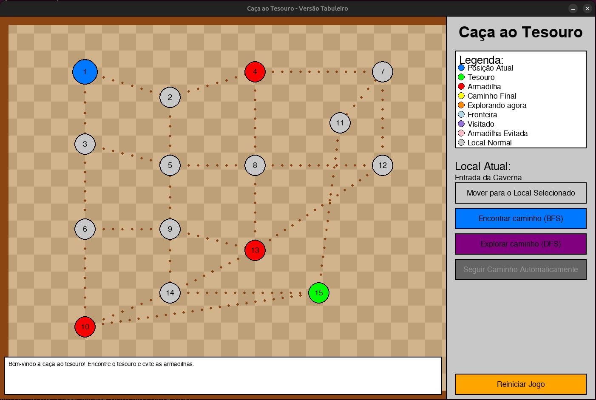
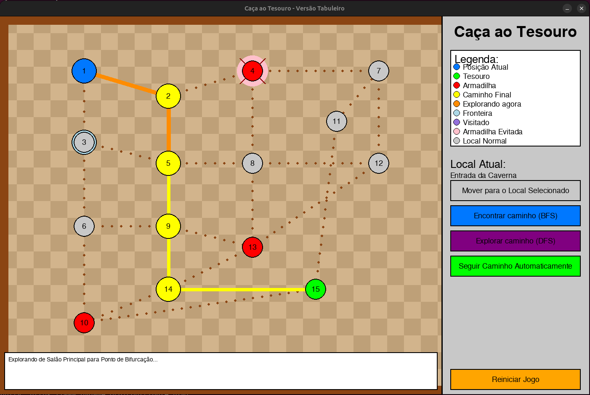
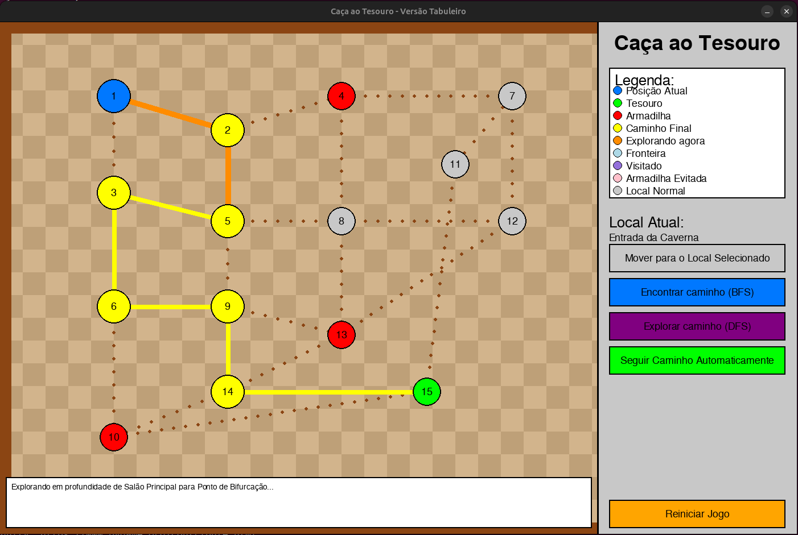

# Grafos1_tesouro

**Número da Lista**: 1<br>
**Conteúdo da Disciplina**: Grafos<br>

## Alunos
|Matrícula | Aluno |
| -- | -- |
| 22/2021933  |  William Bernardo da Silva |
| 22/2015195  |  Mateus de Castro Santos |

## Sobre 

### Jogo de Caça ao Tesouro em Grafo

Este jogo simula uma caça ao tesouro em um mapa representado como um grafo. O jogador deve navegar pelo mapa para encontrar o tesouro, evitando armadilhas.

#### Características

- Mapa representado como um grafo onde:
  - Os nós representam locais no mapa
  - As arestas representam caminhos disponíveis entre locais
  - Nós verdes contêm o tesouro
  - Nós vermelhos são armadilhas que devem ser evitadas

- Dois algoritmos de busca implementados com visualização animada:
  - BFS (Breadth-First Search): Para encontrar o caminho mais curto
  - DFS (Depth-First Search): Para explorar caminhos alternativos

- Interface gráfica interativa usando Pygame com:
  - Visualização do processo de busca em tempo real
  - Cores distintas para diferentes estados dos nós (visitado, fronteira, caminho)
  - Painel informativo com instruções e detalhes do local atual
  - Sistema de legenda para compreensão dos elementos visuais

#### Controles e Mecânicas de Jogo

- **Seleção de local**: Clique em um nó no mapa para selecioná-lo
- **Movimento**: Use o botão "Mover para o Local Selecionado" para se deslocar para o local selecionado
- **Algoritmos de busca**:
  - Use o botão "Encontrar caminho (BFS)" para calcular o caminho mais curto até o tesouro
  - Use o botão "Explorar caminho (DFS)" para encontrar um caminho alternativo
- **Visualização do algoritmo**: Quando um algoritmo é executado, você pode observar:
  - Nós visitados (roxo)
  - Fronteira de exploração (azul claro)
  - Caminho sendo explorado atualmente (laranja)
  - Armadilhas evitadas (marcadas com X)
- **Navegação automática**: Após calcular um caminho, use o botão "Seguir Caminho Automaticamente" para mover-se automaticamente ao longo do caminho encontrado
- **Reiniciar**: O botão "Reiniciar Jogo" permite começar uma nova partida a qualquer momento

#### Diferenças entre BFS e DFS

- **BFS (Breadth-First Search)**: 
  - Explora todos os vizinhos no mesmo nível antes de avançar em profundidade
  - Garante encontrar o caminho mais curto até o tesouro (menor número de movimentos)
  - Visualizado com uma expansão em ondas a partir do ponto inicial

- **DFS (Depth-First Search)**:
  - Explora completamente um caminho até não poder mais avançar antes de retroceder
  - Pode encontrar caminhos mais longos ou diferentes do que o BFS
  - Visualizado como uma exploração profunda em uma direção específica


#### Visualização do processo de busca

Uma característica educativa importante deste jogo é a visualização passo a passo de como os algoritmos BFS e DFS funcionam:
- Observe quais nós são visitados
- Veja como a fronteira de exploração evolui
- Compare a eficiência dos dois algoritmos para encontrar o tesouro
- Entenda como as armadilhas são detectadas e evitadas

**Boa sorte na sua caçada ao tesouro!**

## Screenshots

### Tela inicial


### Exemplo de caminho usando o BFS


### Exemplo de caminho usando o DFS



## Instalação 
**Linguagem**: Python<br>

### Criando ambiente virtual

```
python3 -m venv venv
```

### Ativação do ambiente

```
source venv/bin/activate
```

### Instalação das dependências

```
pip install -r requirements.txt
```


## Uso 

### Execução do arquivo python

Na raíz do repositório execute o comando:

```
python3 jogo_caca_tesouro_pygame.py
```

### Desativação do ambiente (Depois de executar o jogo)

```
deactivate
```
## Outros 

**Link de Apresentação:** [Link do vídeo](https://youtu.be/we66PGZ0TCI?si=LucEeurfj__8MA7x)


